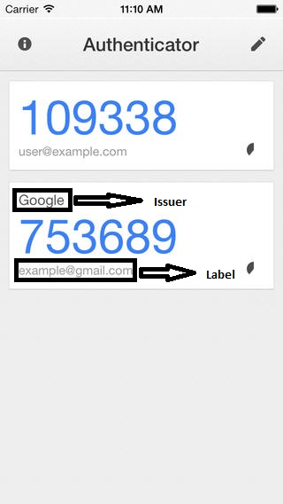

# Yii2 MFA

[](https://packagist.org/packages/vxm/yii2-mfa)
[](https://packagist.org/packages/vxm/yii2-mfa)
[](https://travis-ci.org/vuongxuongminh/yii2-mfa)
[](https://scrutinizer-ci.com/g/vuongxuongminh/yii2-mfa/?branch=master)
[](https://scrutinizer-ci.com/g/vuongxuongminh/yii2-mfa/?branch=master)
[](http://www.yiiframework.com/)

## About it

An extension support implementing multi factor authenticate base on [Spomky-Labs/otphp](https://github.com/Spomky-Labs/otphp) wrapper for Yii2 user component.


## Installation

> **Requires [PHP 7.1+](https://php.net/releases/)**

Require Yii2 MFA using [Composer](https://getcomposer.org):

```bash
composer require vxm/yii2-mfa
```

## Usage

### App config

```php
'components' => [
    'user' => [
        'as mfa' => [
            'class' => 'vxm\mfa\Behavior',
            'verifyUrl' => 'site/mfa-verify' // verify action, see bellow for setup it
        ]
    ],
]
```

### Identity implementing

When use it, your identity class must be implementing `vxm\mfa\IdentityInterface` this interface extends from `yii\web\IdentityInterface` 
add `getMfaSecretKey()`, this method return a mfa key of an identity use for generate and validate otp or return null if mfa disabled on an identity.

```php

use yii\db\ActiveRecord;

use vxm\mfa\IdentityInterface;

class User extends ActiveRecord implements IdentityInterface 
{

    public function getMfaSecretKey()
    {
        return $this->mfa_secret;
    }

}


```

### Verify action config

This action use to redirect user when user login and need to be verify mfa otp. Config it
in to `actions` method of your `controller`

```php

public function actions()
{
    return [
        'mfa-verify' => [
            'class' => 'vxm\mfa\VerifyAction',
            'viewFile' => 'mfa-verify', // the name of view file use to render view. If not set an action id will be use, in this case is `mfa-verify`
            'formVar' => 'model', // the name of variable use to parse [[\vxm\mfa\OtpForm]] object to view file.
            'retry' => true, // allow user retry when type wrong otp
            'successCallback' => [$this, 'mfaPassed'], // callable call when user type valid otp if not set [[yii\web\Controller::goBack()]] will be call.
            'invalidCallback' => [$this, 'mfaOtpInvalid'], // callable call when user type wrong otp if not set and property `retry` is false [[yii\web\User::loginRequired()]] will be call, it should be use for set flash notice to user.
            'retry' => true, // allow user retry when type wrong otp
        ]
    ];
}

```

After setup verify action, you need create a view (mfa-verify) in this view have a variable `model` is instance of `vxm\mfa\OtpForm` use to create a form submit an otp

```php

use yii\helpers\Html;
use yii\widgets\ActiveForm;

$form = ActiveForm::begin();

echo Html::tag('h1', 'Multi factor authenticate');

echo $form->field($model, 'otp');

echo Html::submitButton('Verify');

ActiveForm::end();


```

### QR Code widget for authenticator

After setup all, when user enabled mfa (mfaSecretKey is set) you need to provide a qr code for app like google authenticator to generate an otp. 
Use `vxm\mfa\QrCodeWidget` to render a qr code image in view

```php

use vxm\mfa\QrCodeWidget;


print QrCodeWidget::widget([
    'label' => Yii::$app->user->identity->email,
    'issuer' => Yii::$app->name
]);

```

<p align="center">



</p>

> Notice: when use this widget ensure user had been logged in, if not an `yii\base\InvalidCallException` will be throw.


